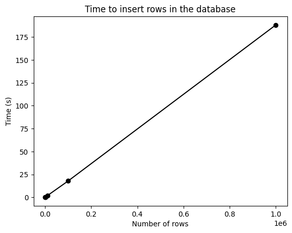
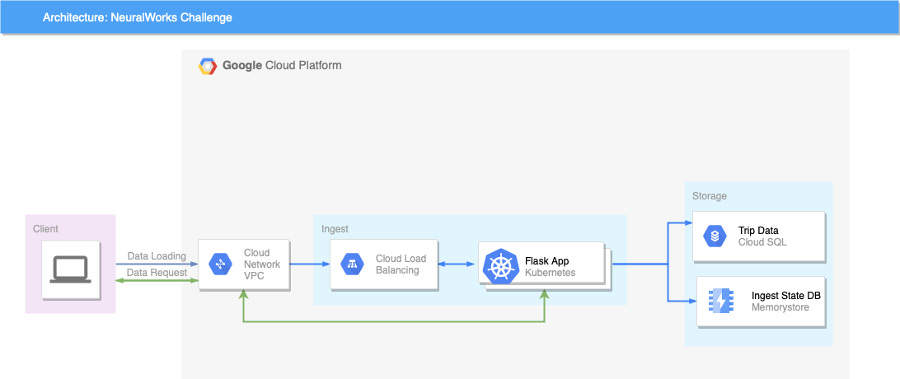

# NeuralWorks Challenge
### Author: Matías Soto
### Email: matias.soto.26@gmail.com

### Date
2023-10-08

### Description
This is a challenge for NeuralWorks

### Technologies
* Python
* Flask
* PostgreSQL
* SQLAlchemy
* Redis
* Docker

### Instructions:
1. Clone this repository
2. Write the .env file following the .env.default file
3. Run `docker build -t neuralworks .`
4. Run `docker run -p 5000:5000 neuralworks`
5. Consult the endpoints below
### Endpoints:
1. POST /trips - Add trips to the database with a csv file
2. GET /trips/average - Get the weekly average of trips
3. GET /trips/ingestion_status - Get the ingestion status of the trips

### TODO:
1. Group similar trips: I would use a clustering algorithm to group similar trips (DBSCAN).
2. Given the specs of my machine, I only ingested 1 million rows. I would use a multiple container architecture with load balancing to ingest more data.

### Time of ingestion vs number of rows:

### Google Cloud Platform Architecture
